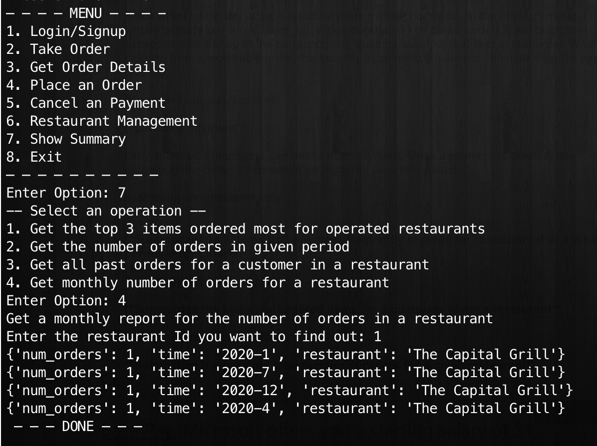

## Restaurant Management System

### Motivation

By creating the restaurant management system, customer can have easy access interact with different restaurants and menus. They can also track delivery if ordering online. Also, for either customers' or staffs', or even restaurant's detailed information, only limited authorized admins can access to read, insert, update and delete records. In addition, the system provides different dining option records. It can log both dine-in and delivery records so that enhance the experience of interaction with the system.

### Getting Started

#### Dependencies

 * System: Mac OS
 * Database: MySQL
 * Host Language: Python3.7
 * Required Python Library: 
 	* pymysql
 	* flask
 * Final product: CLI Application

#### Using the code
 
 In MySQL workbench or other mysql server, execute the script `Wang_final_project.sql`.
 
 Simply set the path to where the file `project_app.py` is. Then in terminal, run
 
 ```
 python project_app.py
 ```
 
 It will prompt user input for *host name*, *user name* and *password*. If nothing input, it will just using the default values (my account).
 
 After that, the terminal will be displayed with a list of options.Then you can just follow the indices of selected operations
 
#### Sample Operations

**Insert a new customer**


**Change the position of a given staff**

Since only authorized managers can modify the staff position and status, to perform this operation, you will need user_id and password that matches the records in manager table. 

Examples to try:

 * user_id: katM
 * password: kate123

Otherwise message will pop up saying you don't have permission


**Show menu of a specific restaurant**


**Modify existing order**

If the order has been linked to a payment record, the status of that order will automatically marked as completed. Then any modification can not be made. On the other hand, if there is no payment records linking to an order, its status will show uncompleted by default. This type of order if modifiable.

Since when taking the order, it is actually doing insert operation on the order_item table whose primary key is (oid, item_id). When duplicated key gets inserted, it will catch the exception and add up to the corresponding quantity value for that item in that order. When deleting from a modifiable order, the quantity to be removed cannot be larger than the existing quantity. 


**Cancel a payment**

Only authorized managers can delete from payment. Once a payment is deleted, the corresponding order status would be triggered as uncompleted


**Summarize top 3 items that are most frequently ordered for restaurant that are not permanently closed**


**Summarize the historical ordered items for a customer given a restaurant**


**Summarize the monthly total number of orders for a given restaurant**


#### Other Constraints that are implicit from front end operation

 * When a restaurant status is set to *closed* for *permanently closed* from *open*, all associated items in item table would be triggered in *not available* status. On the other hand, when a restaurant is returned to *open*, all associated items would be *available*
 * When the status of a manager is set *blocked* in staff table, it will trigger the manager table to delete related record, and that manager won't have authorization even if the status is changed back to *active*, unless access should be request all over again
 * When taking an order, the order_item won't be modified if the requested item is from another restaurant or the requested item is not available currently
 * If an order remains in *uncompleted* status for more than a month, an event would be schedule to change its status into *aborted*
